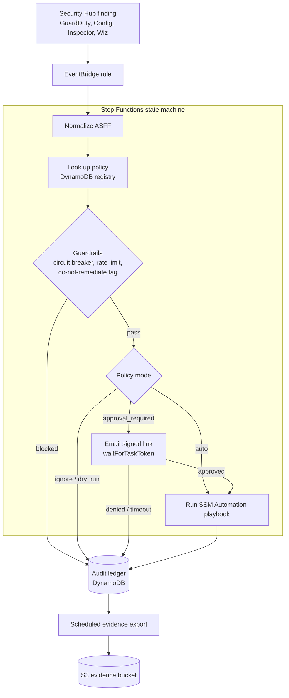

# aws-remediation-orchestrator

[](https://github.com/DustyStudy/aws-remediation-orchestrator/actions/workflows/lint-and-scan.yml)
[](LICENSE)
[](#)

An event-driven engine that turns AWS Security Hub findings into
**governed, auditable** remediation - policy-driven routing, blast-radius
guardrails, a human approval gate for disruptive actions, and a
compliance-evidence export - built on Step Functions, Lambda, and SSM
Automation. Every ARN is partition-aware (`data.aws_partition`), so it
runs in both AWS commercial and GovCloud.

**At a glance**

- **Problem:** auto-remediation that acts on every finding can do more damage
  than the finding. Teams need a human in the loop for disruptive fixes.
- **Approach:** one pipeline with a policy registry, rate limits, a circuit
  breaker, an email approval gate and an audit ledger.
- **Result:** [run end to end in real AWS accounts, twice](docs/PROOF.md):
  once in a single account, and once across four accounts of an AWS
  organization, where playbooks changed real resources in three of them.
  The runs found defects that `terraform validate`, tflint, Checkov, ruff
  and pytest all missed, including an approval callback and a circuit
  breaker that could never succeed. All are fixed, and the proof doc lists
  what the runs did not cover.

## How it works



Every path ends in the ledger, including findings that were blocked, ignored
or denied, so it records what the system decided as well as what it did.
[`docs/ARCHITECTURE.md`](docs/ARCHITECTURE.md) has the full state list and
the known limitations.

## Why this exists

Standalone auto-remediation scripts each detect and fix one thing, with
no shared policy layer, approval gate, or audit trail across them.

This repo puts every Security Hub finding through one pipeline instead.
A **policy registry**, not each playbook's own code, decides whether a
match runs automatically, waits for a human, only logs what it would do,
or is ignored. A **circuit breaker and per-policy rate limit** cap how
much damage a misconfigured detector (or this system itself) can do.
Every decision, acted on or not, lands in an **audit ledger** that
exports as compliance evidence. It ships six playbooks and can dispatch
to a playbook owned by another deployment via
`external_ssm_document_arns`. See
[`docs/ARCHITECTURE.md`](docs/ARCHITECTURE.md) for the full picture.

## What's in the box

| Piece | What it does |
|---|---|
| **Policy registry** (DynamoDB) | Matches a finding's ASFF type/generator against rules that set mode, target playbook, NIST 800-53 mapping, and rate limit. See [`docs/POLICY_REGISTRY.md`](docs/POLICY_REGISTRY.md). |
| **Guardrails** | Org-wide circuit breaker (one SSM parameter), per-policy hourly rate limit with auto-trip on a detector storm, and a generic `do-not-remediate` resource tag denylist (Resource Groups Tagging API - works across resource types with no per-service code). |
| **Approval flow** | `approval_required` policies pause the state machine (`waitForTaskToken`) and email signed one-click approve/deny links; a timeout with no response is treated as a deny. |
| **Remediation execution** | Starts the policy's SSM Automation document and polls it to completion. |
| **Audit ledger** (DynamoDB) | One record per execution outcome - skipped, blocked, denied, dry-run, executed, or failed - with the guardrail result and NIST control mapping that produced it. |
| **Evidence export** (S3, scheduled) | Rolls the ledger up into [`grc-evidence-automation`](https://github.com/DustyStudy/grc-evidence-automation)-shaped JSON documents. See [`docs/EVIDENCE_SCHEMA.md`](docs/EVIDENCE_SCHEMA.md). |
| **Six owned playbooks** | See [Playbooks](#playbooks). |
| **Org mode (optional)** | `org_member_account_ids` turns one deployment in the Security Hub delegated administrator account into the orchestrator for the organization: a playbook runs in the member account that owns the resource, through roles created there by [`terraform/modules/playbook-roles`](terraform/modules/playbook-roles). See [`docs/ORG_MODE.md`](docs/ORG_MODE.md). |
| **Wiz intake (optional)** | `enable_wiz_finding_bridge = true` deploys a webhook endpoint that imports Wiz findings into Security Hub, so they enter the same pipeline. See [`terraform/modules/wiz-finding-bridge`](terraform/modules/wiz-finding-bridge/README.md). |

### Playbooks

Each is an SSM Automation document this repo owns. Point a policy item's
`action_document` at the name from the `playbook_document_names` output.
The suggested mode is what `terraform.tfvars.example` seeds.

| Playbook | What it does | Suggested mode |
|---|---|---|
| `S3PublicAccessRemediation` | Re-applies S3 Block Public Access on the bucket. | `auto` |
| `RevokeOpenSshRdpIngress` | Revokes security group rules that open SSH, RDP or a database port (`open_ingress_revoke_ports`: 22, 3389, 1433, 1521, 3306, 5432, 6379, 9200, 27017) to `0.0.0.0/0` or `::/0`. Narrower rules stay. | `auto` |
| `DisableCompromisedCredentials` | Deactivates every active access key of the IAM user in a GuardDuty finding. | `approval_required` |
| `DeactivateStaleAccessKeys` | Deactivates only the user's keys older than 90 days or unused for 45 (Security Hub IAM.3 / IAM.22). | `approval_required` |
| `RevokeRoleSessions` | Adds the `AWSRevokeOlderSessions` deny (same as the console's "Revoke active sessions") to the role in a GuardDuty credential finding, so stolen role credentials stop working. New sessions still work. | `approval_required` |
| `IsolateCompromisedInstance` | Snapshots the instance's volumes, then moves every network interface to a per-VPC isolation security group with no inbound or outbound rules. Can also stop it. | `approval_required` |

## Quickstart

Needs Terraform >= 1.5, an AWS account with Security Hub enabled in the
target region (GuardDuty too, for the smoke test below), and an email
address you can confirm an SNS subscription from.

```bash
cd terraform
cp terraform.tfvars.example terraform.tfvars
# Set notification_email. The example runs the S3 public-access and
# open-ingress policies in auto mode, which changes resources. Review
# docs/POLICY_REGISTRY.md first, or set them to dry_run.
# New accounts often have a Lambda concurrency limit of 10. Check with
# `aws lambda get-account-settings`; if it is under ~150, also set
# enable_lambda_reserved_concurrency = false.
terraform init
terraform apply
```

Confirm the SNS subscription email, then push a sample finding through:

```bash
DETECTOR=$(aws guardduty list-detectors --query 'DetectorIds[0]' --output text)
aws guardduty create-sample-findings --detector-id "$DETECTOR" \
  --finding-types "Policy:IAMUser/RootCredentialUsage"

# Security Hub ingests it in 1-2 minutes. Then:
aws stepfunctions list-executions \
  --state-machine-arn "$(terraform output -raw state_machine_arn)" --max-results 5
aws dynamodb scan --table-name "$(terraform output -raw remediation_ledger_table_name)" \
  --max-items 5
```

Expect a `SUCCEEDED` execution and a ledger entry. The sample finding matches
no specific rule, so it falls through to the `default` policy and is recorded
as `dry_run`. Nothing in the account is changed.

To pause every remediation at once, set the circuit breaker:

```bash
aws ssm put-parameter --overwrite --value true \
  --name "$(terraform output -raw circuit_breaker_parameter_name)"
```

Tear down with `terraform destroy`. Set `evidence_bucket_force_destroy = true`
first, or empty the evidence bucket. [`docs/PROOF.md`](docs/PROOF.md#4-reproduce-it)
walks through the approval path as well.

## Testing

```bash
pip install -r requirements-dev.txt
pytest tests/ -q          # remediation_common, playbook scripts, Wiz bridge
ruff check terraform tests
```

CI (`.github/workflows/lint-and-scan.yml`) runs pytest/ruff, plus
`terraform fmt`/`validate`/`tflint`/Checkov, on every push and PR.

## Proof

Two live runs. The first, in one account, carried a real finding through a
real human deny click. The second ran org mode across four accounts:
playbooks remediated real buckets, a security group and a role in three
accounts, and the rate limit, circuit breaker, tag denylist and evidence
export all fired. See [`docs/PROOF.md`](docs/PROOF.md).

## Repository layout

```
aws-remediation-orchestrator/
├── terraform/
│   ├── lambda/
│   │   ├── common/python/remediation_common/  # shared logic, packaged as a Lambda layer
│   │   ├── normalize_finding/  lookup_policy/  check_guardrails/
│   │   ├── request_approval/   approval_callback/  execute_remediation/
│   │   └── record_ledger/      export_evidence/
│   ├── ssm-documents*.tf        # the six playbooks this repo owns
│   ├── ssm-documents/scripts/   # their inline aws:executeScript steps
│   ├── modules/playbook-roles/  # the playbooks' IAM roles; also applied in member accounts (org mode)
│   ├── modules/wiz-finding-bridge/  # optional Wiz webhook intake
│   ├── stepfunctions.tf         # the state machine definition
│   ├── eventbridge.tf           # Security Hub ingestion
│   ├── api-gateway.tf           # approval callback endpoint
│   ├── dynamodb.tf              # policy registry, rate limits, pending approvals, ledger
│   ├── kms-data.tf / lambda-common.tf / secrets.tf / s3.tf / ssm-parameter.tf
│   └── terraform.tfvars.example
├── examples/org-mode/           # hub and two member accounts, with a live test script
├── tests/                       # pytest unit tests
└── docs/
    ├── ARCHITECTURE.md
    ├── ORG_MODE.md
    ├── POLICY_REGISTRY.md
    └── EVIDENCE_SCHEMA.md
```

## License

[MIT](LICENSE)
