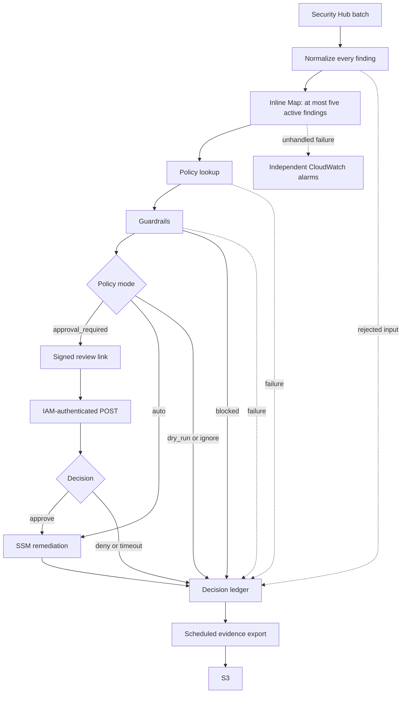

# Architecture

## Batch and failure handling

One EventBridge event starts one Standard workflow. The normalizer emits every
finding in order. Invalid findings and empty envelopes become synthetic rejected
records, so a malformed member does not silently discard a valid sibling.

The inline Map runs at most five findings concurrently, including findings
waiting for approval. Each finding follows the same policy, guardrail and
ledger paths. Policy lookup, guardrail evaluation and approval-request errors
are recorded as failed decisions. Playbook errors have their own failure path.

Ledger calls retry with the state-entry timestamp as their stable record key.
This prevents one state's delivery retries from creating fresh rows. Notifications
can still be duplicated. Repeated events are separate executions; there is no
claim of exactly-once remediation across redeliveries.

A persistent ledger failure, normalization invocation failure, payload/history
limit, or other unhandled workflow error can prevent ledger coverage and stop
unfinished Map iterations. CloudWatch alarms on failed, timed-out and aborted
executions publish independently of the ledger Lambda. This is a recovery
signal, not a guarantee that every event always reaches the ledger.
See [operations and upgrades](OPERATIONS.md).

## Approval boundary

GET on a signed email link only displays the request. POST requires API Gateway
IAM authorization and the signature. Grant the designated operator role
`execute-api:Invoke` on the `approval_invoke_arn` output; an existing Identity
Center permission set can supply this permission.

The callback records the IAM session ARN supplied by API Gateway. It does not
accept an actor from a query parameter. The first decision and actor are
immutable. The same actor may retry that decision after a transient delivery
failure, but an opposing decision or different actor cannot replace it.

Only an acknowledged Step Functions callback is marked consumed. Both approval
and denial return structured results to the waiting state, which branches on
the decision and carries the actor into the ledger. A closed token can mean
expiry or prior completion; the endpoint reports that ambiguity and directs the
operator to history instead of claiming success.

## Component responsibilities

| Component | Responsibility |
|---|---|
| `normalize_finding` | Validate and normalize a batch; preserve rejected outcomes |
| `lookup_policy` | Match the registry and apply the severity floor |
| `check_guardrails` | Circuit breaker, hourly limits, onboarding and resource exemptions |
| `request_approval` / `approval_callback` | Request a decision, authenticate its submission and resume the waiting task |
| `execute_remediation` | Start and poll the SSM playbook |
| `record_ledger` | Persist the outcome and notify |
| `export_evidence` | Export ledger entries to S3 |

## Deliberate limits

- Polling stays inside the execution Lambda because the supplied playbooks make
  short API sequences. Move long-running playbooks to a Step Functions
  Wait/Choice loop before exceeding the Lambda's polling deadline.
- Evidence export scans the small ledger. A date-bucketed index becomes useful
  when measured volume justifies it.
- Inline Maps share the Standard execution's history and payload limits.
  For substantially larger batches or many long approvals, use separately
  tracked child executions and measure concurrency before changing the design.
- IAM proves the session that submitted a decision. Correct role assignment,
  session-name attribution and offboarding remain the operator's responsibility.
- If a callback response is lost after AWS accepts it, history is the source
  of truth. Delivery retries do not guarantee an unambiguous HTTP success.
- [Historical live proof](PROOF.md) predates the IAM POST and batch changes.
  Unit tests and mocked Terraform tests do not prove live encrypted alarm
  delivery, IAM authorization or cross-service availability.

## Other deployments

The registry can select one of the six owned playbooks or an explicitly
authorized external SSM document. [Org mode](ORG_MODE.md) dispatches to roles
in the finding's member account. The optional Wiz bridge imports ASFF into
Security Hub, entering the same batch pipeline.
