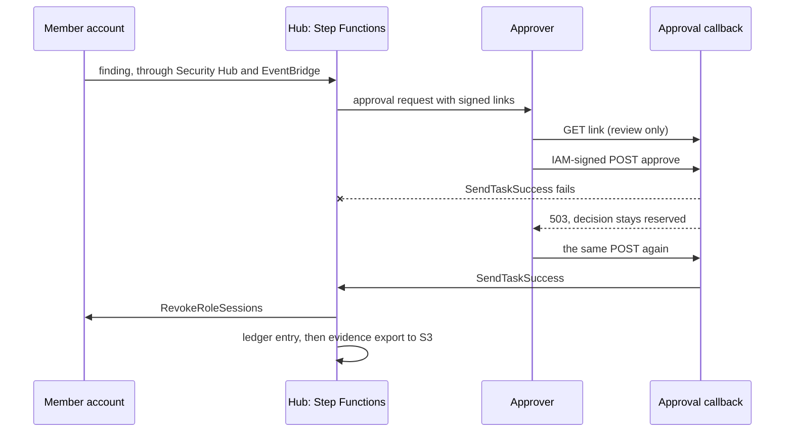

# Case study: one finding, from detection to exported evidence

One GuardDuty-shaped finding followed through a live deployment: Security
Hub delivery, the approval request, a decision whose delivery fails and is
recovered, the remediation in a member account, the ledger entry and the
exported evidence document. Every time below comes from AWS's own records.

- **Date:** 2026-10-10 (UTC)
- **Revision:** [`f2ac7c0`](https://github.com/DustyStudy/aws-remediation-orchestrator/commit/f2ac7c0001b7b985d01ef52d0712773537d100f3)
- **Deployment:** [`examples/org-mode`](../examples/org-mode), 140 resources:
  108 in the hub (the Security Hub delegated administrator account) and 16
  playbook-role resources in each of two member accounts, `us-east-1`, with
  the organization's service control policies in force
- **Driver:** [`live_test_approval.py`](../examples/org-mode/live_test_approval.py)
- **Raw evidence:** [`proof/approval-recovery-run.json`](proof/approval-recovery-run.json),
  account IDs and role session names masked

## The scenario

Credentials for an instance role are reported as used from outside AWS.
The policy for that finding type is `approval_required`: nothing changes
until a named person approves, and then `RevokeRoleSessions` denies every
session of the role issued before that moment.

## Timeline

Seconds are measured from the start of the Step Functions execution, taken
from its execution history.

| At | What happened | Checked against |
|---|---|---|
| -10.3 s | The finding is imported in the member account with `BatchImportFindings` | Client clock, so approximate |
| 0.0 s | Security Hub has delivered it to the hub and EventBridge starts the execution | Execution start time |
| 0.4 s | Normalized; one finding enters the Map state | State entered |
| 1.5 s | Policy matched: `guardduty-role-credential-exfiltration` | State entered |
| 3.0 s | Guardrails passed; `RequestApproval` stores the task token and publishes the request | State entered |
| 4.5 s | The approval request is published to the notifications topic | SNS timestamp |
| 8 s | GET on the Approve link returns 200 and `No decision has been submitted`. The pending request still has no decision | DynamoDB, consistent read |
| 40 s to 301 s | The decision is submitted, fails to deliver and is recovered: [see below](#failure-and-recovery) | DynamoDB, Step Functions, CloudTrail |
| 301.1 s | Step Functions receives `approve` and the approver's ARN; `ExecuteRemediation` starts | State entered |
| 309.0 s | The SSM automation has finished in the member account; `RecordExecuted` writes the ledger entry | State entered, SSM |
| 310.3 s | Execution `SUCCEEDED` | Execution stop time |

Without the injected fault the path is 3.0 s to the approval request and
7.9 s from the decision to the finished remediation. The rest is the
approver.

## Failure and recovery

The callback reserves a decision in DynamoDB, delivers it to Step
Functions, and marks the request consumed only once Step Functions has
acknowledged it. To exercise the middle step failing, the run attached an
inline policy to the callback function's role that denied
`states:SendTaskSuccess`, then removed it.

| Time (UTC) | Request | Response | Pending request afterwards | Execution |
|---|---|---|---|---|
| 00:27:57 | GET Approve link | 200, review text | no decision, not consumed | `RUNNING` |
| 00:28:29 | POST Approve, fault in place | **503** `Delivery not confirmed. Retry the same decision with the same IAM session.` | `approve`, reserved to the approver, not consumed | `RUNNING` |
| 00:28:30 | POST Deny, same approver | **409** `Request expired, resolved, or reserved by another decision/approver.` | unchanged | `RUNNING` |
| 00:28:30 | Fault removed | | | |
| 00:28:31 to 00:32:33 | POST Approve, 14 attempts | 503 each time | unchanged | `RUNNING` |
| 00:32:50 | POST Approve from a new process | **200** `Decision delivered: approve.` | consumed | `RUNNING`, then `SUCCEEDED` at 00:32:59 |

What that shows:

- **A failed delivery strands nothing.** After the 503 the request was
  still open, the execution was still waiting, and the same decision could
  be sent again.
- **A reserved decision cannot be flipped.** The Deny was refused while
  Approve was reserved, so a lost response cannot end with the opposite
  decision being recorded.
- **Delivery is retried, not repeated.** Fifteen failed attempts and one
  success produced one remediation and one ledger entry.
- **CloudTrail agrees.** The failed attempts appear as `AccessDenied` on
  `SendTaskSuccess`, naming an explicit deny in an identity-based policy.

## Remediation and evidence

| | |
|---|---|
| **Automation** | `remediation-orchestrator-RevokeRoleSessions`, status `Success`, steps `RevokeSessions` and `NotifyStep`, started in the member account by `remediation-orchestrator-member-execution-role` |
| **Resource change** | The role gained the inline policy `AWSRevokeOlderSessions`: deny all actions where `aws:TokenIssueTime` is before `2026-10-10T00:32:54Z` |
| **Ledger entry** | `outcome: executed`, `execution_status: Success`, `decided_by` the approver's assumed-role ARN, NIST controls AC-2, IR-4, IA-5 |
| **Evidence export** | One document per account under `remediation-orchestrator/2026-10-10/` in the evidence bucket. The member account's reads `3 finding(s) evaluated ... 1 remediated, 2 dry-run, 0 blocked by guardrail, 0 denied, 0 failed`, status `pass`, with a SHA-256 of its own content |
| **Alarms** | `ExecutionsFailed`, `ExecutionsTimedOut` and `ExecutionsAborted` all `OK` after the run |

The two dry-run findings in that summary are from the batch below.

## A batch in one execution

Security Hub has delivered one finding per event in every run so far, so
the batch path was started directly: one execution whose input holds two
well-formed findings and one malformed entry, shaped like the event
EventBridge delivers.

| Entry | Ledger outcome |
|---|---|
| `batch-1` | `dry_run`, policy `live-test-rate-limit` |
| `batch-2` | `dry_run`, policy `live-test-rate-limit` |
| malformed (`{"Id": 3}`) | `skipped`, reason `malformed_finding_or_empty_batch`, recorded as `rejected:<event id>:2` |

The execution took 2.1 s and succeeded. The malformed entry did not stop
the other two, and it left its own record.

## What the run found

The control held on every step. Three things about operating it surfaced:

1. **A removed IAM deny kept applying for four minutes.** The fault policy
   was deleted at 00:28:30 and `SendTaskSuccess` was still refused at
   00:32:33. During that window the callback kept answering 503 and the
   decision stayed reserved, which is the designed behavior, but an
   operator who has just fixed a permission should expect retries to fail
   for several minutes. The first version of the driver gave up after
   three; it now waits seven.
2. **A retry has to carry the reserving session name.** The reservation is
   bound to the approver's full assumed-role ARN, session name included. A
   CLI profile that assumes a role gets a new session name in every
   process unless it sets `role_session_name`. The run's final attempt came
   from a new process that assumed the role under the original session
   name. [OPERATIONS.md](OPERATIONS.md#recover-delivery) now says how to
   keep the name stable. Identity Center sessions use the sign-in name and
   are not affected.
3. **The earlier test driver's deny step moved to the IAM-signed POST.**
   `live_test_playbooks.py deny` used a GET, which now only reviews. It
   submits through `scripts/decide.py`; that stage has not been re-run.

## Operating numbers

Measured in a sandbox organization, three accounts, one region.

| | |
|---|---|
| Deploy, 140 resources | 1 min 26 s (`terraform apply` of a saved plan) |
| Finding imported to execution started | 10.3 s |
| Execution start to approval request | 3.0 s |
| Decision delivered to remediation finished | 7.9 s |
| Three-finding batch, dry run | 2.1 s |
| Fault removed to delivery acknowledged | 4 min 20 s |
| Teardown, 140 resources | 1 min 23 s (`terraform apply` of a saved destroy plan) |

Teardown left the state empty. The approval signing secret stays in Secrets
Manager's seven-day recovery window, so a redeploy within a week needs
`aws secretsmanager delete-secret --force-delete-without-recovery` first.

## What this does not show

- **Cost.** Not measured for this run.
- **A person submitting the decision.** The driver submitted it through
  `scripts/decide.py`'s `submit` function with the hub profile's
  credentials; the interactive prompt was not used.
- **A retry under a different session name being refused.** The callback's
  DynamoDB condition requires the same ARN, but this run only sent the
  matching name, so the refusal itself was not observed.
- **A second approver, an Identity Center permission set, or a narrowly
  scoped `execute-api:Invoke` grant.** The approver was an administrator
  role in the hub account.
- **A batch delivered by Security Hub**, and a batch larger than the Map
  state's concurrency of five.
- **The failure alarms firing.** No execution failed, so they stayed `OK`.
- **Other regions, scale and GovCloud**, as in the earlier runs.

## Reproduce it

1. Deploy `examples/org-mode` with its `terraform.tfvars.example`. Keep
   `approval_timeout_seconds` at 600 or more.
2. `python live_test_approval.py setup --hub <profile> --member-a <profile> --member-b <profile>`
3. Run `send`, then `decide`, then `resume`.
4. Run `batch`, then `collect`. It writes `live-test-approval-evidence.json`
   with account IDs and session names masked.
5. Run `cleanup`, then `terraform destroy`.
